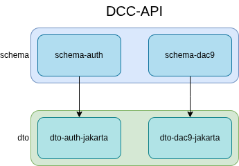

= Architektúra
:toc: left
:toclevels: 3
:sectnums:
:icons: font
:source-highlighter: highlight.js
:nofooter:

A DCC API egy többmodulos Maven projekt, amely a NAV DAC (Directive on Administrative Cooperation)
M2M interfész sémadefinícióit tartalmazza. A projekt három fő réteget definiál:

. *Séma réteg* (`schema`) - XSD sémadefiníciók
. *DTO réteg* (`dto`) - Jakarta EE Data Transfer Object-ek, az XSD sémákból generálva
. *BOM réteg* (`bom`) - Bill of Materials a függőségek központi verziókezeléséhez

== Projekt struktúra

[source,text]
----
DCC-API
├── bom/
│   ├── bom-all/               # Teljes BOM (projekt + külső függőségek)
│   └── bom-project/           # Csak projekt modulok BOM-ja
├── schema/
│   ├── schema-auth/           # M2M Token API séma
│   └── schema-dac9/           # DAC9 Global Tax API séma
├── dto/
│   ├── dto-auth/
│   │   └── dto-auth-jakarta/  # Generált Jakarta EE DTO-k schema-auth sémából
│   └── dto-dac9/
│       └── dto-dac9-jakarta/  # Generált Jakarta EE DTO-k schema-dac9 sémából
└── docs/                      # Dokumentáció
----

== Modul hierarchia

=== Séma modulok

==== schema-auth

Az M2M autentikációs token API XSD sémáját tartalmazza.

==== schema-dac9

A DAC-9 szolgáltatások API XSD sémáját tartalmazza.

=== DTO modulok

==== dto-auth-jakarta

Jakarta EE DTO osztályok, amelyek az `schema-auth` XSD sémáiból generálódnak JAXB segítségével.

* *Függőségek:*
** `hu.gov.nav.schemas.common2:dto-jakarta` - Közös NTCA 2.0 DTO-k
** `hu.gov.nav.dcc.api:schema-auth` - Auth séma definíciók

==== dto-dac9-jakarta

Jakarta EE DTO osztályok, amelyek az `schema-dac9` XSD sémáiból generálódnak JAXB segítségével.

* *Függőségek:*
** `hu.gov.nav.schemas.common2:dto-jakarta` - Közös NTCA 2.0 DTO-k
** `hu.gov.nav.dcc.api:schema-dac9` - DAC9 séma definíciók

== Függőségi diagram

== Névtér stratégia

A projekt az alábbi névtér hierarchiát alkalmazza:

[cols="1,2"]
|===
| Névtér minta | Leírás

| `+http://schemas.nav.gov.hu/NTCA/2.0/common/*+`
| NTCA 2.0 közös sémák (Common projekt)

| `+http://schemas.nav.gov.hu/DCC/1.0/m2m/token/*+`
| DCC M2M autentikációs sémák

| `+http://schemas.nav.gov.hu/DCC/1.0/m2m/dac9/*+`
| DCC M2M DAC9 sémák
|===

A névterek a `schemas.nav.gov.hu` alatt szerveződnek, a `DCC/1.0` verziónévvel, az `m2m` prefix pedig
a gépi kommunikáció jellegét jelöli.

== Technológiai stack

[cols="1,2"]
|===
| Technológia | Verzió / Leírás

| *Java* | 17
| *Jakarta EE* | JAXB 3.0 (Jakarta XML Binding)
| *Maven* | Multi-module POM struktúra
| *JAXB plugin* | `org.jvnet.jaxb:jaxb-maven-plugin:4.0.9`
| *JAXB kiegészítők* | Fluent API (`jaxb2-fluent-api:3.0`), Annotate (`jaxb-plugin-annotate:4.0.8`)
| *XSD Catalog* | OASIS XML Catalog alapú névtér feloldás
| *Közös sémák* | `hu.gov.nav.schemas.common2:2.0.0-rc.1` (NTCA Common)
|===
